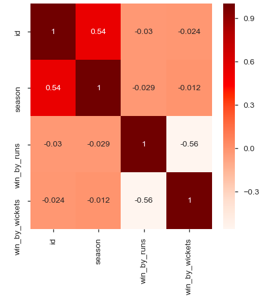
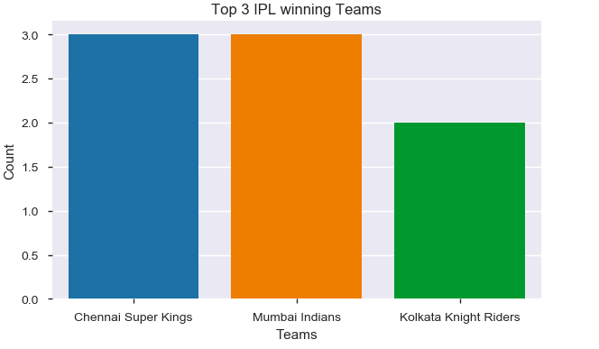
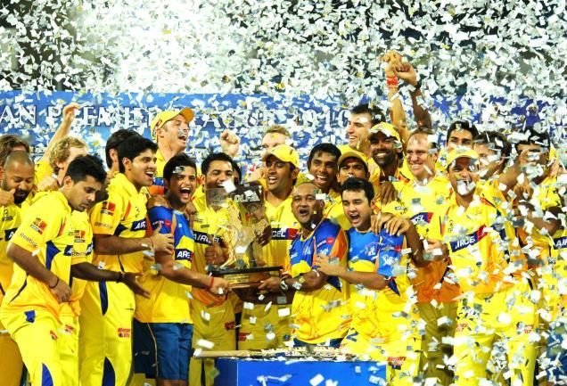
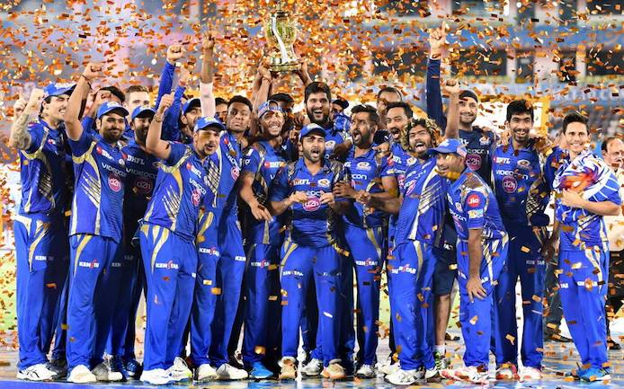

# IPL Exploratory Data Analysis(2008-18)

## INTRODUCTION
The __Indian Premier League (IPL)__, is a professional Twenty20(refers to 20 over per innings) cricket league in India contested during April and May of every year by teams representing at least 8 Indian cities and some states. The league was founded by the __Board of Control for Cricket in India (BCCI) in 2008__. The __IPL__ is the most-attended cricket league in the world. Top Cricket Players from all over the world participate in this league. __IPL__ since its onset, 10 years ago, has been a platform for the young cricketers to showcase their skills and to adapt to the competitive atmosphere along with the foreign players as their teammates.

The __top two teams__ from the league phase will play against each other in the first __Qualifying match__, with the winner going straight to the __IPL final__ and the loser getting another __chance to qualify__ for the IPL final by playing the second Qualifying match. Meanwhile, the third and fourth place teams from league phase play against each other in an eliminator match and the winner from that match will play the loser from the first Qualifying match. The winner of the second Qualifying match will move onto the final to play the winner of the first Qualifying match in the IPL Final match, where the winner will be crowned the __Indian Premier League champions__.

## DATA
| Column Name | Description |
| --- | --- |
| `ID`                 | Match id                                                        | 
| `Season`             | IPL year                                                        |  
| `City`               | Match city                                                      | 
| `Date`               | Date of match                                                   |    
| `Team1`              | Playing Team1                                                   |
| `Team2`              | Playing Team2                                                   |
| `Toss_Winner`        | Toss Winning Team                                               |
| `Toss_Decision`      | Toss winning team decision  to Bat/Bowl first                |
| `Result`             | Type of Result                                                  |
| `DL Applied`         | Duckworth Lewis method applied  or not in case of bad weather|
| `Winner`             | Winning team                                                    |
| `Win_by_Runs`        | Margin of runs for winning team                                 |
| `Win_by_Wickets`     | Margin of wickets for winning team                              |
| `Player_of_match`    | Best player of match                                            |
| `Venue`              | Stadium Name                                                    |
| `Umpire1`            | Primary umpire                                                  |
| `Umpire2`            | Secondary umpire                                                |
| `Umpire3`            | TV umpire                                                       |

## PROJECT ANALYSIS
| Description | Analysis |
| --- | --- |
| IPL_data_head |  |
| Correalation |  |
| Most_Wins |  |
| Most_Trophy_winners |  |

### Conclusion
- We saw how __Exploratory Data Analysis__ helped us in getting meaningful insights from raw data. 
- We used different Python libraries like matplotlib, seaborn etc. to plot various graphs. 
- CSK and MI have dominated the IPL.

[Jupyter Notebook](./IPL_Notebook.ipynb)
