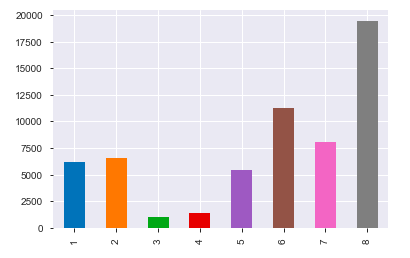
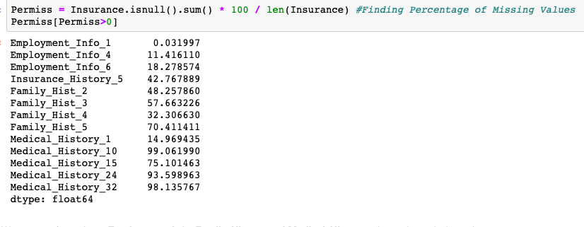
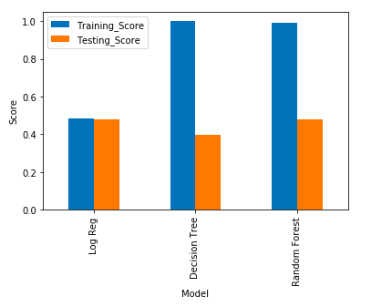
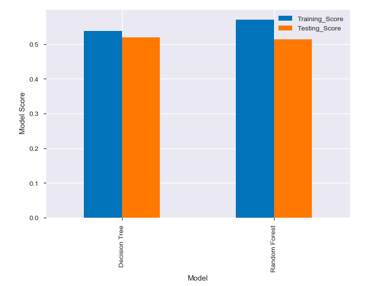

# Risk Prediction on Insurance Data

## INTRODUCTION
__Insurance__ is a means of protection from financial loss.It can cover your loss caused either by accident or other unpredicted factors. Insurance firms gathers data from customers and on the basis of provided data they provide insurance. Insurance is one of the essentials which an individual should have for the more contented future of his family in his absence.

## DATA
| Column Name | Description |
| --- | --- |
| `Id` | Unique Customer Id |
| `ProductInfo_1-7` | A set of normalized variables relating to the product applied for |
| `Ins_Age`| Normalized age of applicant|
| `Ht` | Normalized height of applicant |
| `Wt` | Normalized weight of applicant |
| `BMI` | Normalized BMI of applicant |
| `Employment_Info_1-6` | A set of normalized variables relating to the employment history of the  applicant |
| `InsuredInfo_1-7` | A set of normalized variables providing information about the applicant |
| `Insurance_History_1-9` | A set of normalized variables relating to the insurance history of the  applicant |
| `Family_Hist_1-5` | A set of normalized variables relating to the family history of the applicant |
| `Medical_History_1-41` | A set of normalized variables relating to the medical history of the applicant |
| `Medical_Keyword_1-48` | A set of dummy variables relating to the presence of/absence of a medical  keyword being associated with the application |
| `Response` | This is the target variable, an ordinal variable relating to the final decision  associated with an application |

## PROJECT ANALYSIS
| Description | Analysis |
| --- | --- |
| Dependent_Var |  |
| Missing_Values |  |
| Model_with_Def_Param |  |
| Model_with_Gridsearch |  |

### Conclusion
- This notebook helps us understanding the risk classification of customers while giving insurance using predictive Machine Learning Algorithms.
- 
- We have used below three __ML algos__ for prediction:
    - Logistic Regression
    - Decision Tree
    - Random Forest
- We used above algorithm with default parameters and have seen overfitting in case of Decision Tree and Random Forest.
- We have used again Decision tree and Random Forest using hyper parameters and have seen both are giving around same accuracy.
- As Response Variable is __imbalanced__, we may need to use some resampling techniques and use some other models to increae the accuracy/precision/recall.

[Jupyter Notebook](./Insurance.ipynb)
