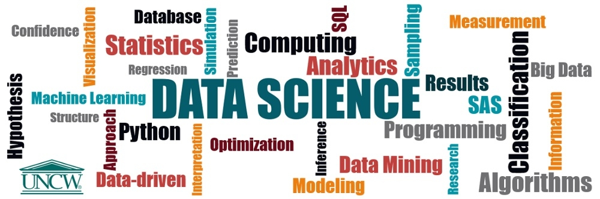

# DataScienceUsingPython

  
Data Science is a latest __buzzword__ floating around. It is one of the most interesting subfield of Computer Science. 

__What does Data Science really means?__ 
Data Science is the art of getting meaningful insights from data and use it for making business strategies. Data Science uses Machine Learningthat provides systems the ability to automatically learn and improve from experience without being explicitly programmed. 

The process of learning begins with data, such as, direct experience, or instruction, in order to look for patterns in data and make better decisions in the future based on the examples that we provide. __The primary aim is to allow the computers learn automatically__ without human intervention or assistance and adjust actions accordingly.

## Repository Overview
This repository is about different Datasets used in real world.

## Table of Contents
- [IPL EDA](#section1) 

___

### [IPL EDA](./IPL EDA)
  
- Indian Premiere League(IPL) is T20 cricket league where players from all over the world participate.
- Research shows that the __Chennai Super Kings(CSK) and Mumbai Indians(MI)__ are the most successful teams.
- An effort to show the Exploratory Data Analysis which helps in understanding the data in simple way.
- [Link for the Jupyter notebook](./IPL EDA/IPL_Notebook.ipynb)

## Projects in execution
